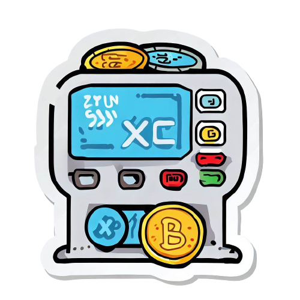

# 💱 Realtime Currency Converter

A sleek, modern currency converter web application built with HTML, CSS, and JavaScript. It uses live exchange rates via the ExchangeRate API and supports 150+ currencies. Toggle between light and dark mode for a personalized experience.

## Features
- Real-time currency conversion
- Supports 150+ global currencies
- Dark mode toggle
- One-click currency swap
- Error handling and validation
- Clean and responsive UI

## Tech Stack
HTML5, CSS3, JavaScript (ES6+), ExchangeRate API

## File Structure
project-root  
├── index.html (Main HTML file)  
├── style.css (Styling and dark mode)  
├── script.js (Conversion logic & interactivity)  
├── currencyCodes.js (Currency list and API key)  
└── coinExchangeSticker.png (UI image/logo)

## Setup Instructions
1. Clone the repository  
git clone https://github.com/your-username/realtime-currency-converter.git  
cd realtime-currency-converter

2. Replace the API key in `currencyCodes.js`  
export const api = "YOUR_API_KEY_HERE";  
You can get a free API key from https://www.exchangerate-api.com/

3. Run the project  
Open index.html in your browser  
Or use a local server:  
npx live-server

## Author
Ayush Srivastava  
Email: ayushsrivastava9336@gmail.com  
GitHub: https://github.com/ayusshs16  
LinkedIn: https://www.linkedin.com/in/ayush-srivastava-a3718a349

Made with 💚 by Ayush to simplify currency conversion for everyone.
